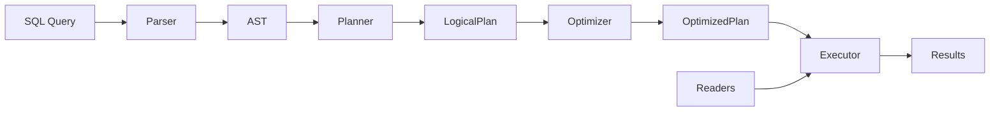

# Design Overview

SQLStream is designed as a lightweight, modular SQL query engine. It follows a classic database architecture but is optimized for querying files directly rather than managing storage.

## Components

1.  **Parser**: Converts SQL strings into an Abstract Syntax Tree (AST).
2.  **Planner**: Converts the AST into a Logical Plan.
3.  **Optimizer**: Applies optimizations like predicate pushdown to the Logical Plan.
4.  **Executor**: Converts the optimized plan into a Physical Plan and executes it.
    - **Volcano Executor**: Pure Python, streaming iterator-based.
    - **Pandas Executor**: Vectorized, in-memory execution.
5.  **Readers**: Abstractions for reading data from various sources (CSV, Parquet, S3).

## Data Flow

