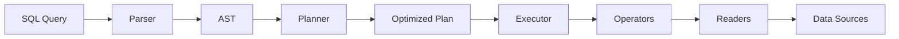

# Core Concepts

Understanding the key concepts behind SQLStream will help you use it more effectively.

---

## Architecture Overview

SQLStream is built around these core components:



---

## The Volcano Model

SQLStream uses the **Volcano iterator model** for query execution:

### What is it?

Each operator in the query plan implements two methods:

- `open()`: Initialize the operator
- `next()`: Return the next row (or None when done)

### Why Volcano?

✅ **Lazy Evaluation**: Rows are produced on-demand
✅ **Low Memory**: Only one row in memory at a time
✅ **Composable**: Operators stack like LEGO blocks
✅ **Predictable**: Easy to understand and debug

### Example

```sql
SELECT name FROM employees WHERE salary > 80000 LIMIT 5
```

Execution flow:

```
Limit(5)
  ↓ next()
Project(name)
  ↓ next()
Filter(salary > 80000)
  ↓ next()
Scan(employees.csv)
  ↓ next()
CSV Reader
```

Each operator calls `next()` on the operator below it until it gets a row.

---

## Execution Backends

SQLStream offers two execution backends:

### Python Backend

**How it works**: Pure Python implementation using the Volcano model

**Pros**:

- ✅ No dependencies
- ✅ Easy to understand
- ✅ Works everywhere

**Cons**:

- ❌ Slower for large datasets
- ❌ Row-at-a-time processing

**Best for**:

- Learning and education
- Small files (<100K rows)
- Quick prototyping

### Pandas Backend

**How it works**: Translates SQL to pandas operations

**Pros**:

- ✅ **10-100x faster** than Python backend
- ✅ Vectorized operations
- ✅ Optimized C code

**Cons**:

- ❌ Requires pandas dependency
- ❌ Loads full dataset into memory

**Best for**:

- Production workloads
- Large files (>100K rows)
- Performance-critical applications

---

## Query Optimizations

SQLStream applies several optimizations automatically:

### 1. Column Pruning

**What**: Only read columns that are actually used

**Example**:

```sql
SELECT name FROM employees
```

SQLStream only reads the `name` column from the CSV, not all columns.

**Benefit**: Faster I/O, less memory

### 2. Predicate Pushdown

**What**: Apply filters as early as possible

**Example**:

```sql
SELECT name FROM employees WHERE department = 'Engineering'
```

The filter is applied during the scan, not after loading all rows.

**Benefit**: Fewer rows to process

### 3. Lazy Evaluation

**What**: Only compute results when needed

**Example**:

```python
results = query("data.csv").sql("SELECT * FROM data LIMIT 10")
# Nothing executed yet!

for row in results:
    print(row)  # Now it executes, one row at a time
```

**Benefit**: Save computation for unused results

---

## Data Sources

SQLStream supports multiple data sources:

### CSV Files

```python
query("data.csv")
```

- Automatic delimiter detection
- Header row inference
- Type inference (strings, numbers)

### Parquet Files

```python
query("data.parquet")  # Requires: pip install "sqlstream[parquet]"
```

- Columnar storage
- Better compression
- Schema included

### HTTP URLs

```python
query("https://example.com/data.csv")  # Requires: pip install "sqlstream[http]"
```

- Streaming support
- Automatic format detection
- Caching (planned)

### Inline Paths (Phase 7.6)

```bash
sqlstream query "SELECT * FROM 'data.csv'"
```

- No need to pre-specify file
- Multi-file queries
- More intuitive

---

## Lazy vs. Eager Evaluation

### Lazy (Default)

```python
result = query("data.csv").sql("SELECT * FROM data")
# ✅ Nothing executed yet

for row in result:  # Executes one row at a time
    print(row)
```

**Advantages**:

- Low memory usage
- Can process infinite streams
- Early termination possible

### Eager

```python
result = query("data.csv").sql("SELECT * FROM data").to_list()
# ❌ Executes immediately, loads all data
```

**Advantages**:

- Random access to results
- Easier to work with
- Can get length with `len()`

**Choose lazy** when:

- Processing large files
- Only need first N results
- Streaming to another system

**Choose eager** when:

- Results fit in memory
- Need to access results multiple times
- Using with pandas/numpy

---

## Query Lifecycle

1. **Parse**: SQL string → AST (Abstract Syntax Tree)
2. **Plan**: AST → Execution plan
3. **Optimize**: Apply optimizations (column pruning, etc.)
4. **Execute**: Build operator pipeline
5. **Iterate**: Pull rows through the pipeline

---

## Memory Model

### Python Backend

```
Memory Usage = O(1)  # One row at a time
```

Perfect for:

- Large files that don't fit in RAM
- Streaming applications
- Long-running processes

### Pandas Backend

```
Memory Usage = O(n)  # Full dataset in memory
```

Perfect for:

- Files that fit in RAM
- Multiple passes over data
- Complex aggregations

---

## Error Handling

SQLStream provides helpful error messages:

### Parse Errors

```sql
SELECT * FORM data  # Typo: FORM instead of FROM
```

```
Error: Expected 'FROM' but got 'FORM' at position 9
```

### File Not Found

```python
query("missing.csv")
```

```
Error: File not found - missing.csv
```

### Type Errors

```sql
SELECT * FROM data WHERE age > 'thirty'  # Comparing number to string
```

```
Error: Cannot compare age (int) with 'thirty' (str)
```

---

## Best Practices

### 1. Use Column Names

✅ **Good**:
```sql
SELECT name, age FROM employees
```

❌ **Bad**:
```sql
SELECT * FROM employees
```

### 2. Add WHERE Clauses

✅ **Good**:
```sql
SELECT * FROM logs WHERE date = '2024-01-01'
```

❌ **Bad**:
```sql
SELECT * FROM logs  # Processes all rows
```

### 3. Choose the Right Backend

```python
# Small files (<100K rows)
query("data.csv").sql("SELECT * FROM data", backend="python")

# Large files (>100K rows)
query("data.csv").sql("SELECT * FROM data", backend="pandas")
```

### 4. Limit Results Early

✅ **Good**:
```sql
SELECT * FROM data WHERE active = true LIMIT 100
```

❌ **Bad**:
```python
results = query("data.csv").sql("SELECT * FROM data").to_list()[:100]
```

### 5. Use Lazy Evaluation

✅ **Good**:
```python
for row in query("large.csv").sql("SELECT * FROM large"):
    process(row)  # One row at a time
```

❌ **Bad**:
```python
rows = query("large.csv").sql("SELECT * FROM large").to_list()
for row in rows:  # All rows in memory!
    process(row)
```

---

## Next Steps

- [SQL Support](../features/sql-support.md) - Learn supported SQL syntax
- [Pandas Backend](../features/pandas-backend.md) - Deep dive into performance
- [Architecture](../architecture/design.md) - Understand the internals
- [Optimizations](../architecture/optimizations.md) - How optimizations work
