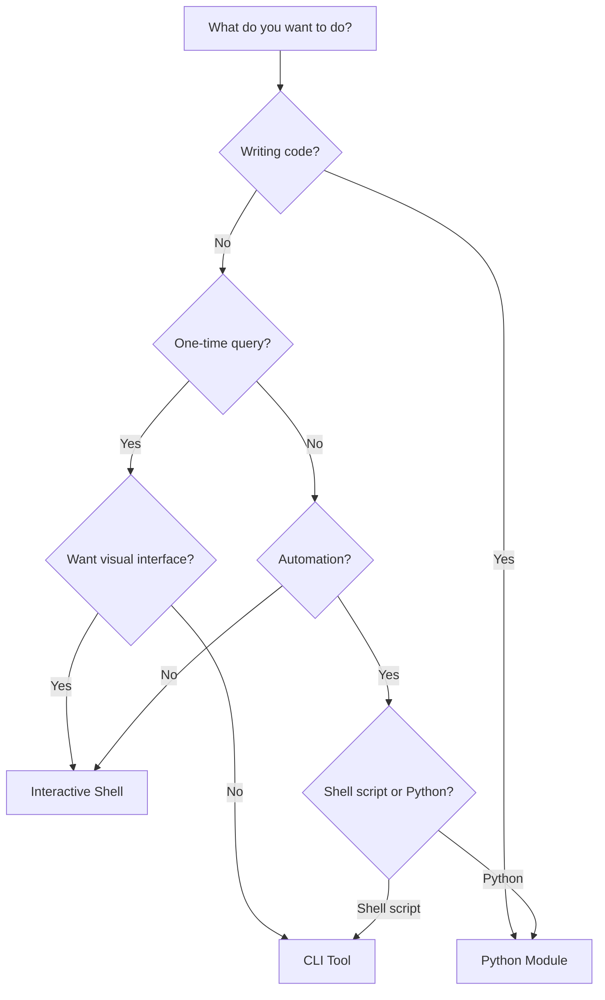

# Which Mode Should I Use?

SQLStream can be used in three different ways. This guide will help you choose the right one for your needs.

---

## Quick Decision Tree



---

## Mode Comparison

| Feature | Python Module | CLI Tool | Interactive Shell |
|---------|--------------|----------|-------------------|
| **Interface** | Python API | Command-line | Full TUI |
| **Use Case** | Programmatic | Scripting | Exploration |
| **Learning Curve** | Medium | Easy | Easy |
| **Automation** | ✅ Excellent | ✅ Excellent | ❌ Not suitable |
| **Interactivity** | ❌ None | ❌ None | ✅ Excellent |
| **Multiple Queries** | ✅ Yes (in code) | ❌ One at a time | ✅ Yes (tabs) |
| **Visual Feedback** | ❌ Code only | ❌ Terminal output | ✅ Rich UI |
| **CI/CD Integration** | ✅ Excellent | ✅ Excellent | ❌ Not suitable |
| **Jupyter Compatible** | ✅ Yes | ❌ No | ❌ No |
| **State Persistence** | ❌ No | ❌ No | ✅ Yes (tabs, history) |
| **File Browser** | ❌ No | ❌ No | ✅ Yes |
| **Query History** | ❌ No | ❌ No | ✅ Yes (per tab) |
| **Export Built-in** | ❌ No (code it) | ✅ Yes (--format) | ✅ Yes (Ctrl+X) |

---

## Python Module

### When to Use

- You're writing Python code or scripts
- You need to integrate queries into a larger application
- You're working in Jupyter notebooks
- You want programmatic control over results
- You're building data pipelines or ETL workflows
- You need to process results with other Python libraries (pandas, numpy, etc.)
- You want to automate complex data workflows

### Example Use Cases:

```python
# Data analysis in Jupyter
from sqlstream import query
import pandas as pd

results = query("sales.csv").sql("SELECT * FROM sales WHERE amount > 1000")
df = pd.DataFrame(results.to_list())
df.plot()
```

```python
# ETL pipeline
from sqlstream import query

# Extract
raw_data = query("raw_data.csv").sql("""
    SELECT * FROM raw_data
    WHERE date > '2024-01-01'
""")

# Transform
for row in raw_data:
    # Process and load to database
    insert_to_db(row)
```

```python
# API endpoint
from fastapi import FastAPI
from sqlstream import query

app = FastAPI()

@app.get("/sales/")
def get_sales(min_amount: int):
    results = query("sales.csv").sql(f"""
        SELECT * FROM sales WHERE amount > {min_amount}
    """)
    return results.to_list()
```

[Get Started with Python Module →](../python-module/quickstart.md)

---

## CLI Tool

### When to Use

- You want quick one-off queries
- You're writing bash/shell scripts
- You need to pipe output to other Unix tools
- You're automating tasks with cron jobs
- You're working in CI/CD pipelines
- You prefer command-line workflows
- You want to save results to files quickly

### Example Use Cases:

```bash
# Quick data inspection
$ sqlstream query data.csv "SELECT COUNT(*) FROM data WHERE status = 'active'"

# Shell script automation
#!/bin/bash
HIGH_VALUE=$(sqlstream query sales.csv "SELECT COUNT(*) FROM sales WHERE amount > 10000" --format json | jq '.[0].count')
if [ "$HIGH_VALUE" -gt 100 ]; then
    echo "Alert: High-value sales threshold exceeded"
    send_alert.sh
fi

# CI/CD validation
$ sqlstream query test_data.csv "SELECT * FROM test_data WHERE quality_score < 0.8" --format csv > failed_tests.csv
```

```bash
# Pipe to other tools
$ sqlstream query data.csv "SELECT * FROM data" --format json | jq '.[] | select(.amount > 1000)'

# Save to file
$ sqlstream query data.csv "SELECT * FROM data WHERE status = 'pending'" --format csv > pending.csv
```

```bash
# Cron job
# Run every day at 2am
0 2 * * * sqlstream query "/data/logs.csv" "SELECT * FROM logs WHERE level = 'ERROR'" --format json > /reports/errors_$(date +\%Y\%m\%d).json
```

[Get Started with CLI Tool →](../cli-tool/quickstart.md)

---

## Interactive Shell

### When to Use

- You're exploring data interactively
- You want to try multiple queries quickly
- You need visual feedback on results
- You're learning SQL or the tool
- You want to work with multiple queries simultaneously (tabs)
- You need a file browser to navigate data files
- You want your work saved automatically between sessions
- You're generating reports or doing ad-hoc analysis

### Example Use Cases:

**Data Exploration:**
- Open unknown CSV file
- Browse schema to understand columns
- Run exploratory queries across multiple tabs
- Filter and sort results visually
- Export filtered results

**Report Generation:**
- Load multiple data files
- Write complex queries with JOINs
- Switch backends to optimize performance (F5)
- Filter results to final dataset
- Export to CSV/JSON for reporting

**Learning & Development:**
- Try different SQL queries
- View query execution plans (F4)
- Compare different approaches across tabs
- Use query history to refine queries
- See immediate visual feedback

[Get Started with Interactive Shell →](../interactive-shell/quickstart.md)

---

## Common Scenarios

### "I want to analyze CSV files in Jupyter"
→ **Python Module** - Import `sqlstream` and query directly in notebook cells

### "I need to run the same query every day via cron"
→ **CLI Tool** - Use `sqlstream query` in a cron job

### "I'm exploring a new dataset and don't know what's in it"
→ **Interactive Shell** - Browse files, view schema, try queries interactively

### "I'm building a data pipeline in Python"
→ **Python Module** - Integrate queries into your pipeline code

### "I want to quickly check if any rows meet a condition"
→ **CLI Tool** - One-liner: `sqlstream query data.csv "SELECT COUNT(*) FROM data WHERE condition"`

### "I need to analyze data with multiple complex queries"
→ **Interactive Shell** - Use tabs for different queries, save state between sessions

### "I'm writing a bash script to process files"
→ **CLI Tool** - Call `sqlstream` from bash, pipe output

### "I want to process query results with pandas"
→ **Python Module** - Query with SQLStream, convert to DataFrame

### "I need to generate a weekly report"
→ **Interactive Shell** (for development) + **CLI Tool** (for automation)
- Develop queries in shell
- Copy final query to CLI for automation

---

## Can I Use Multiple Modes?

**Yes!** You can mix and match modes:

1. **Develop in Interactive Shell, Automate with CLI**
   - Use the shell to develop and test queries
   - Copy working queries to CLI scripts for automation

2. **Prototype in CLI, Integrate in Python**
   - Test queries with `sqlstream query`
   - Once working, integrate into Python code

3. **Explore with Shell, Analyze with Python**
   - Use shell for initial data exploration
   - Switch to Python/Jupyter for detailed analysis

---

## Still Not Sure?

### Try This:

1. **Start with Interactive Shell** (`sqlstream shell`)
   - Most user-friendly
   - Great for learning
   - See what SQLStream can do

2. **Then try CLI Tool** for quick queries
   - Faster for one-off queries
   - Better for scripting

3. **Finally Python Module** when you need programmatic control
   - Most powerful
   - Best for integration

---

## Get Started

<div class="grid cards" markdown>

-   [:material-language-python: **Python Module**](../python-module/quickstart.md)

    Programmatic queries in Python code

-   [:material-console-line: **CLI Tool**](../cli-tool/quickstart.md)

    Command-line queries and scripting

-   [:material-application: **Interactive Shell**](../interactive-shell/quickstart.md)

    Full TUI for data exploration

</div>
